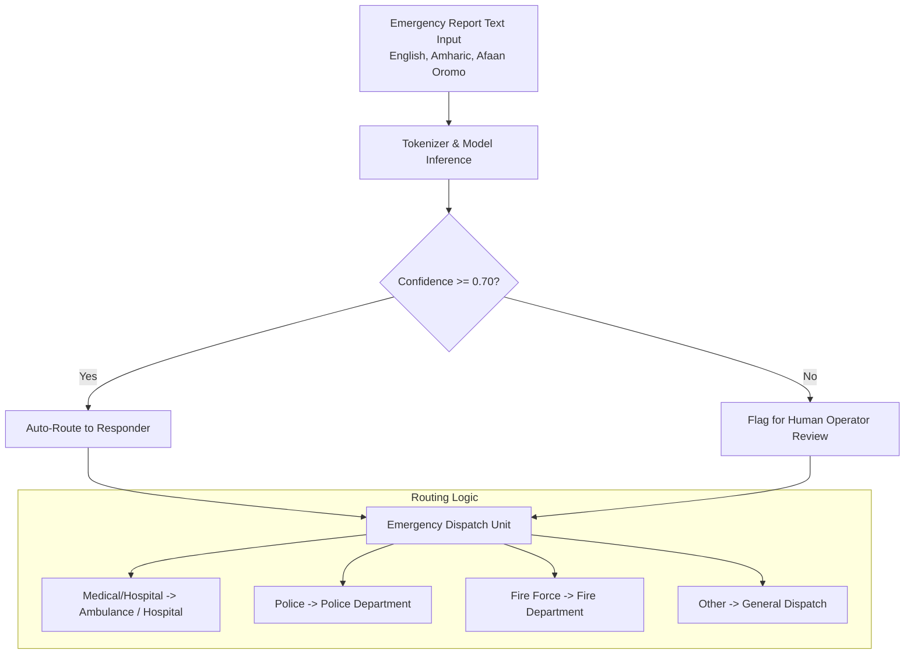

# 🚨 ERAS - Emergency Response Alert System: AI Classifier Project Documentation

Welcome to the comprehensive technical documentation for the **ERAS (Emergency Response Alert System) AI Classifier**. This project contains a complete fine-tuning, evaluation, serving, and deployment pipeline for a multilingual emergency text classification system powered by a **DistilBERT** language model.

---

## 📖 Project Overview & Goal

The primary goal of the **ERAS AI Classifier** is to automatically analyze emergency incident reports written in text form and categorize them into specific emergency types. This automated triage allows for:
- **Rapid dispatch routing**: Directing requests to the correct emergency responders instantly.
- **Improved emergency dispatching**: Reducing human routing errors.
- **Multilingual support**: Handling text inputs in **English**, **Amharic (አማርኛ)**, and **Afaan Oromo**, which are crucial for regional dispatch in Ethiopia.

### Emergency Categories
The system classifies input texts into four primary target labels:

| Category | Description | Primary Responder / Routed To |
|:---|:---|:---|
| 🚑 **Medical/Hospital** | Health emergencies, cardiac events, injuries, medical fits | Ambulance / Hospital |
| 🚔 **Police** | Crimes, theft, assault, robbery, suspect sitings | Police Department |
| 🚒 **Fire Force** | Fires, explosions, gas leaks, electrical fires | Fire Department |
| 💬 **Other** | Non-emergency messages, test signals, query texts | General Dispatch (needs review/filtering) |

---

## 🛠️ System Architecture

The following diagram illustrates the flow of emergency report data from the end-user/API client through the DistilBERT model, confidence checks, and dispatch routing:



---

## 📁 Repository Directory Structure

Here is a breakdown of the repository and how the files fit together:

```
AI Classifier/
├── Traning Data/
│   ├── eras_master_training_data.csv       # Original dataset (~3,500 samples)
│   ├── eras_synthetic_training_data (1).csv# Synthetic dataset (~2,500 samples)
│   └── eras_combined_training_data.csv     # Merged and deduplicated dataset (~6,000 samples)
├── training/
│   ├── __init__.py                         # Package initializer
│   ├── train_distilbert.py                 # Core trainer script containing ERASDistilBERTTrainer
│   ├── train_combined.py                   # Script to merge datasets and run combined training
│   ├── retrain_on_synthetic.py             # Trainer script focused solely on synthetic data
│   ├── evaluate_model.py                   # Verification suite and production classifier module
│   └── predict_emergency.py                # Command-line interface and module for predictions
├── api/
│   ├── __init__.py                         # API package initializer
│   └── server.py                           # FastAPI web server serving predictions
├── models/                                 # Saved weights and artifacts (Git-ignored / Auto-created)
│   ├── best_model/                         # Saved checkpoints from training
│   ├── eras_distilbert_final/               # Production-ready model directory loaded by server.py
│   ├── training_history.png                # Accuracy and Loss validation curves
│   └── confusion_matrix.png                # Performance validation confusion matrix
├── AI_Cl/                                  # Hugging Face Space package for demo
│   ├── app.py                              # Gradio web app definition
│   ├── requirements.txt                    # Gradio app Python requirements
│   └── model/                              # Local copy of the model (populated during deployment)
├── deployment/                             # Backup Hugging Face Space deployment directory
│   ├── app.py                              # Gradio web app definition
│   └── requirements.txt                    # Gradio app Python requirements
├── requirements.txt                        # Global requirements file for model training/API serving
└── README.md                               # Brief introduction README
```

---

## 📊 Data Management & Processing

The training pipeline supports multiple datasets. The dataset files are CSV files with at least two key columns:
- `text`: The textual report of the emergency (in English, Amharic, or Afaan Oromo).
- `label`: The emergency type (`Medical/Hospital`, `Police`, `Fire Force`, or `Other`).

### Combined Training Dataset Creation
In [train_combined.py](file:///c:/Users/nibru/Documents/Dev/Dev/GC%20Project/AI%20Classifier/training/train_combined.py), the `eras_master_training_data.csv` and `eras_synthetic_training_data (1).csv` datasets are loaded and combined. To prevent overfitting, duplicate texts are removed using Pandas:
```python
df_combined = pd.concat([df_master, df_synthetic], ignore_index=True)
df_combined = df_combined.drop_duplicates(subset=['text'])
df_combined = df_combined.dropna(subset=['text', 'label'])
```
This combined and cleaned dataset is saved to `eras_combined_training_data.csv` for training.

---

## 🏋️ Model Training Pipelines

The core training logic is contained inside the `ERASDistilBERTTrainer` class in [train_distilbert.py](file:///c:/Users/nibru/Documents/Dev/Dev/GC%20Project/AI%20Classifier/training/train_distilbert.py). It includes components for data loading, model initialization, training loops, evaluation, plotting, and model saving.

### 1. Custom PyTorch Dataset
The inputs are tokenized using `DistilBertTokenizer` with a max token length of `128` (since emergency reports are typically short):
```python
class EmergencyDataset(Dataset):
    def __init__(self, texts, labels, tokenizer, max_len=128):
        self.texts = texts
        self.labels = labels
        self.tokenizer = tokenizer
        self.max_len = max_len
        
    def __getitem__(self, idx):
        ...
        encoding = self.tokenizer(
            text, truncation=True, padding='max_length',
            max_length=self.max_len, return_tensors='pt'
        )
        return {
            'input_ids': encoding['input_ids'].squeeze(),
            'attention_mask': encoding['attention_mask'].squeeze(),
            'labels': torch.tensor(label, dtype=torch.long)
        }
```

### 2. Training Hyperparameters
The pipeline is tuned specifically for `distilbert-base-uncased` fine-tuning:
* **Optimizer**: `AdamW` with weight decay `0.01`
* **Learning Rate**: `2e-5` (with a linear learning rate scheduler and warm-up ratio `0.1`)
* **Batch Size**: `16` (can be reduced to `8` to avoid GPU Out-Of-Memory error)
* **Epochs**: `5` (recommended balanced setting)

### 3. Checkpointing and Visualizations
* **Best Model Checkpointing**: In each epoch, if the validation accuracy improves, the model weights, tokenizer configurations, and a `label_encoder.json` mapping are written to `models/best_model`.
* **Exporting final model**: The final iteration model is saved in `models/eras_distilbert_final` along with a metadata description file `training_config.json`.
* **Metrics plots**: Visualizations of validation accuracy, training/validation loss, and a confusion matrix heatmap are automatically saved to the `models/` directory.

---

## 🔍 Inference & Evaluation

The system offers a production-ready prediction module: [evaluate_model.py](file:///c:/Users/nibru/Documents/Dev/Dev/GC%20Project/AI%20Classifier/training/evaluate_model.py) implements the `ERASEmergencyClassifier` class, which manages loading models and predicting labels with confidence scores.

### Prediction & Routing Logic
For any input report text, the classifier returns:
1. **Classification label**: The predicted class (`Medical/Hospital`, `Police`, `Fire Force`, or `Other`).
2. **Confidence**: The softmax probability distribution score of the prediction.
3. **Needs Review**: A boolean flag indicating if the confidence is below the threshold of `0.7`. If true, the system recommends routing to a human operator.
4. **Routing Info**: A dictionary highlighting which responder is required:
   ```json
   "routing": {
       "primary_responder": "Ambulance / Hospital",
       "requires_ambulance": true,
       "requires_police": false,
       "requires_fire": false,
       "is_non_emergency": false
   }
   ```

You can execute predictions using CLI command:
```bash
python training/predict_emergency.py "Fire at Adama Market!"
```

---

## 🚀 FastAPI Server Implementation (`api/server.py`)

A high-performance FastAPI web server serves the model for real-time predictions. The server handles model loading on startup using FastAPI's `lifespan` handler and supports cross-origin requests (CORS).

### API Endpoints

* **`GET /health`**
  Returns API server health status, whether the model has loaded successfully, the hardware device in use (CPU vs. CUDA), and the current timestamp.
  
* **`GET /model/info`**
  Provides metadata about the loaded DistilBERT classifier, class label names, target labels mapping, confidence thresholds, and training history metadata.
  
* **`POST /predict`**
  Classifies a single emergency report text.
  * *Request Body:*
    ```json
    {
      "text": "Robbery in progress at the bank on Bole Road",
      "language": "english"
    }
    ```
  * *Response Body:*
    ```json
    {
      "text": "Robbery in progress at the bank on Bole Road",
      "emergency_type": "Police",
      "confidence": 0.9984,
      "needs_review": false,
      "routing": {
        "primary_responder": "Police Department",
        "requires_ambulance": false,
        "requires_police": true,
        "requires_fire": false,
        "is_non_emergency": false
      },
      "all_scores": {
        "Fire Force": 0.0003,
        "Medical/Hospital": 0.0008,
        "Other": 0.0005,
        "Police": 0.9984
      },
      "timestamp": "2026-05-24T00:15:30.123456"
    }
    ```

* **`POST /predict/batch`**
  Classifies up to 50 reports in a single query.
  * *Request Body:*
    ```json
    {
      "texts": [
        "Gas leak in the basement",
        "My grandfather is having chest pains",
        "Hello, test message"
      ]
    }
    ```

---

## 🌐 Gradio Demo App & Deployment

The demo applications ([AI_Cl/app.py](file:///c:/Users/nibru/Documents/Dev/Dev/GC%20Project/AI%20Classifier/AI_Cl/app.py) and [deployment/app.py](file:///c:/Users/nibru/Documents/Dev/Dev/GC%20Project/AI%20Classifier/deployment/app.py)) define a web interface using the **Gradio Blocks API**:
- **Inputs**: Text area for user report input and pre-populated clickable multilingual example buttons.
- **Outputs**: Score distribution bar chart (Gradio Label) and a detailed markdown overview specifying primary responder dispatch routing and confidence warnings.

### How to Deploy to Hugging Face Spaces
1. Create a Space on [Hugging Face](https://huggingface.co/spaces) with **Gradio** SDK.
2. Copy `AI_Cl/app.py`, `AI_Cl/requirements.txt`, and the model contents `models/eras_distilbert_final` into the Space.
3. Keep the model files in a subfolder named `model/` inside the space directory so `app.py` can load them using `MODEL_DIR = Path("model")`.
4. Git push the changes to Hugging Face. The Space will build and serve your Gradio web application automatically!

---

## ⚡ Quick Start Guide

Follow these steps to run the pipeline, start the API server, or launch the demo interface.

### 1. Environment Setup
Create a Python virtual environment and install dependencies:
```powershell
# Create virtual environment
python -m venv .venv

# Activate virtual environment
.venv\Scripts\Activate.ps1

# Install training and API dependencies
pip install -r requirements.txt
```

### 2. Run Model Training
Choose one of the training commands depending on your dataset preferences:
```powershell
# Option A: Train on Master Data (~3.5k samples)
python training/train_distilbert.py

# Option B: Retrain on Synthetic Data (~2.5k samples)
python training/retrain_on_synthetic.py

# Option C: Merge datasets and train on Combined Data (~6k samples)
python training/train_combined.py

# Option D (Recommended): Merge datasets and train on Combined 20k+ Data
python training/train_combined_20k.py
```
*Note: This generates models under the `models/` directory.*

### 3. Evaluate the Model
Run predictions on a pre-defined test suite to check multilingual classification accuracy:
```powershell
python training/evaluate_model.py
```

### 4. Run CLI Predictions
Test custom prompts using the command-line interface:
```powershell
python training/predict_emergency.py "Fire at the building next door!"
```

### 5. Launch FastAPI Server
Run the FastAPI application locally:
```powershell
uvicorn api.server:app --host 0.0.0.0 --port 8000 --reload
```
You can access the interactive API docs at: [http://localhost:8000/docs](http://localhost:8000/docs)

### 6. Launch Gradio Web App
Install Gradio requirements and launch the web interface locally:
```powershell
# Copy the trained model to the AI_Cl/model directory
xcopy /E /I models\eras_distilbert_final AI_Cl\model

# Install Gradio package
pip install -r AI_Cl/requirements.txt

# Run the app
python AI_Cl/app.py
```
This opens the Gradio web dashboard in your default web browser (usually at `http://127.0.0.1:7860`).

---

*This project is built as a core component of the Emergency Response Alert System (ERAS).*
